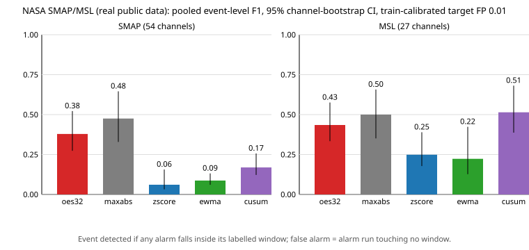

# OES-Resilience

**Benchmarking telemetry intelligence under real-world stress**: an open, reproducible benchmark for multichannel telemetry anomaly detection, with **OES32** as its transparent reference detector.

[](https://github.com/sparkainlp-x/oes-resilience/actions/workflows/tests.yml)
[](LICENSE)
[](https://doi.org/10.5281/zenodo.23071166)
[](.github/workflows/tests.yml)
[](#what-it-is-not)
[](#what-it-is-not)

Version 0.5.0 adds the first evaluation on **real public telemetry**: a [blind, preregistered comparison on the NASA SMAP/MSL anomaly dataset](#real-public-telemetry-nasa-smapmsl-v050) (Hundman et al. 2018). The protocol was locked and pushed before any test data was scored. Under it, OES32 did **not** meet its pre-stated success criterion: it beat only EWMA on SMAP, and `maxabs` and CUSUM scored a higher pooled F1 (not significantly). Version 0.4.0 added [replay evaluation](#replay-evaluation-v040). It scores a recorded or synthetic telemetry replay against a hashed preregistration using the same detectors, and by default every threshold is calibrated to the shared ~1% FP budget. Version 0.3.0 added a seeded [stress suite](#stress-suite-v030) with robustness metrics. It covers drift, baseline steps, missing channels, clipping and saturation, heavy-tailed noise, narrow and cross-block events, global shift plus burst, and correlated blocks. That release also added mask-aware scoring for missing data and an `oes32+ewma` hybrid detector, which measurably does not beat EWMA alone. Version 0.2.0 added the detector plugin API, robust z-score, EWMA and CUSUM baselines (plus an optional Isolation Forest), multi-step synthetic streams and a calibrated [detector comparison](#detector-comparison-v020). Both build on the v0.1.0 benchmark harness, four **synthetic** single-frame regimes and the OES32 reference detector, whose v0.1 results below are unchanged. NumPy is the only required dependency. Everything except the clearly labelled v0.5 SMAP/MSL section is synthetic, and the synthetic numbers say nothing about real telemetry.

## What it is

- **A reproducible benchmark harness.** Each trial generates a synthetic 512-channel signal and splits it into sixteen 32-channel blocks. The harness asks whether a detector flags the right blocks and reports false-positive, detection, exact-match, overlap (IoU) and localization metrics.
- **A transparent reference detector (OES32).** Every 32-channel block gets the score `0.45·max|x| + 0.35·RMS(x) + 0.20·mean|x|`. A block is flagged when its score is `>= threshold` (default 0.50). There are no learned parameters, and the whole rule fits on one line.
- **Deterministic by construction.** Trial *i* of each regime is seeded with `numpy.random.SeedSequence(seed, spawn_key=(regime_key, i))`. The results JSON, summary CSV and manifest are byte-for-byte reproducible, and run metadata (time, platform) goes in a separate file.
- **A small Python package** (`oes_resilience/`) with a CLI (`run`, `sweep`, `compare`, `stress`, `replay`, `test`), a documented [detector plugin API](docs/detector-api.md) and a tested library API. NumPy is the only required dependency.

## What it is not

- **Not quantum.** No qubits, quantum hardware or quantum error correction are involved. The separate, unreleased [qbench concept module](#quantum-benchmark-evidence-layer-concept-unreleased) only orchestrates *classical simulators* of small circuits and adds statistics and hashing; it has no hardware results.
- **Not GPS or navigation.** It does not estimate position, timing or trajectories.
- **Not a physical sensor or device.** It reads no hardware, and all signals are generated synthetically by NumPy.
- **Not a medical, safety or certified system,** and not an operational monitoring product.
- **Not evidence about real telemetry, except where labelled.** All results except the v0.5 SMAP/MSL section describe how this software behaves on its own synthetic regimes. They are not performance claims about any real system or dataset. The SMAP/MSL section describes one public, labelled dataset under one locked protocol, and nothing beyond it.

## Synthetic regimes (v0.1.0)

| regime | how each signal is generated | expected OES32 behaviour |
|---|---|---|
| `stable` | N(0, 0.05) on all 512 channels | no blocks flagged |
| `noisy` | N(0.25, 0.10) on all channels | no blocks flagged |
| `localized_burst` | `stable`, plus N(0.80, 0.15) added to one random 32-channel block | exactly the injected block flagged |
| `global_shock` | N(2.0, 0.5) on all channels | most or all blocks flagged |

## Measured results (seed 42, 1000 trials per regime, threshold 0.50)

Command: `oes-resilience run --trials 1000 --seed 42 --threshold 0.50 --strict` (exit 0). The summary is committed as [`examples/baseline_summary.csv`](examples/baseline_summary.csv), and CI checks that it is reproduced byte for byte.

| regime | false-positive rate | detection rate | exact match | mean detected blocks | per-trial max-score range |
|---|---|---|---|---|---|
| stable | 0.000 (0/1000; 95% upper bound 0.38%) | 0.000 | 1.000 | 0.00 | 0.080 – 0.143 |
| noisy | 0.000 (0/1000; 95% upper bound 0.38%) | 0.000 | 1.000 | 0.00 | 0.361 – 0.471 |
| localized_burst | n/a | 1.000 | 1.000 | 1.00 | 0.822 – 1.153 |
| global_shock | n/a | 1.000 | 1.000 (all 16 blocks) | 16.00 | 2.524 – 3.211 |

All five expectation checks pass at 1000 trials. These checks are software-behaviour thresholds defined in the code: false positives ≤ 1% for stable and noisy, burst detection ≥ 99% and exact match ≥ 95%, and a majority of blocks in ≥ 99% of shock trials.

**The noisy margin is thin.** The largest noisy block score in those 1000 trials was 0.471. In a 100,000-trial run at threshold 0.50, 13 noisy trials crossed it, a false-positive rate of **0.013%** (95% upper bound 0.022%; the largest noisy score was 0.514). The rate rises quickly below 0.50: 0.26% at 0.47, 0.67% at 0.46 and 1.5% at 0.45. So "no detections" is what normally happens, not a guarantee.

### Threshold sweep 0.30–1.00 (step 0.05, 1000 trials)

Command: `oes-resilience sweep`. Full table: [`examples/sweep_summary.csv`](examples/sweep_summary.csv).

| threshold | noisy FP | burst detection | burst exact match | all checks pass |
|---|---|---|---|---|
| 0.30 | 1.000 | 1.000 | 1.000 | no |
| 0.35 | 1.000 | 1.000 | 1.000 | no |
| 0.40 | 0.487 | 1.000 | 1.000 | no |
| 0.45 | 0.014 | 1.000 | 1.000 | no |
| 0.50 – 0.80 | 0.000 | 1.000 | 1.000 | yes |
| 0.85 | 0.000 | 0.990 | 0.990 | yes (at the boundary) |
| 0.90 | 0.000 | 0.888 | 0.888 | no |
| 0.95 | 0.000 | 0.509 | 0.509 | no |
| 1.00 | 0.000 | 0.138 | 0.138 | no |

The stable false-positive rate is 0 and the shock regime flags all 16 blocks at every threshold in the sweep. The default of 0.50 sits at the low edge of the passing range (0.50–0.85).

## Detector comparison (v0.2.0)

`oes-resilience compare` runs every detector through the same fit, calibration and evaluation steps and writes a scorecard (JSON, CSV and Markdown). The [detector API guide](docs/detector-api.md) has the full method; in short:

- **Fit.** Detectors that learn a baseline (`zscore`, `iforest`) are fitted on 1000 stable plus 1000 noisy frames.
- **Calibrate.** Every threshold is calibrated the same way on a separate, held-out clean set: at most 1% of stable and at most 1% of noisy calibration units may reach it.
- **Evaluate.** The frame track uses the exact v0.1 trials. The stream track uses 1000 streams per regime, each 64 steps long with 16 warm-up steps and the event onset at step 24–48.
- **Reproducibility.** The scorecard JSON/CSV hash matched across reruns (`--verify`) and was identical on Python 3.10/NumPy 1.26 and Python 3.13/NumPy 2.2. The committed [`examples/compare_scorecard.csv`](examples/compare_scorecard.csv) is checked byte for byte in CI.

**Frame track** (v0.1 regimes, 1000 trials each). All rows except `oes32@0.50` use calibrated thresholds:

| detector | threshold | stable FP | noisy FP | burst recall / exact / IoU | shock recall / exact |
|---|---|---|---|---|---|
| oes32 (calibrated) | 0.4543 | 0.000 | 0.009 | 1.000 / 1.000 / 1.000 | 1.000 / 1.000 |
| oes32@0.50 (v0.1 reference) | 0.50 | 0.000 | 0.000 | 1.000 / 1.000 / 1.000 | 1.000 / 1.000 |
| zscore | 1.2258 | 0.000 | 0.006 | 1.000 / 1.000 / 1.000 | 1.000 / 1.000 |

The frame regimes are easy: every frame detector separates them perfectly once calibrated. They differ only in how many noisy frames cross the threshold, and that is set by the calibration target.

**Stream track** (1000 streams per regime; FP counts any alarm on a clean stream after warm-up; latency is measured in steps after onset):

| detector | stable FP | noisy FP | burst recall (latency) | shift recall / exact | shift latency mean / median / p90 | shock recall (latency) |
|---|---|---|---|---|---|---|
| oes32 | 0.000 | 0.012 | 1.000 (0) | 0.000 / 0.000 | – | 1.000 (0) |
| zscore | 0.000 | 0.007 | 1.000 (0) | 0.000 / 0.000 | – | 1.000 (0) |
| ewma | 0.007 | 0.008 | 1.000 (0) | 0.987 / 0.985 | 6.99 / 6 / 13 | 1.000 (0) |
| cusum | 0.007 | 0.003 | 1.000 (0) | 0.954 / 0.954 | 14.21 / 14 / 19 | 1.000 (0) |
| oes32+ewma (added in v0.3.0) | 0.006 | 0.015 | 1.000 (0) | 0.985 / 0.983 | 7.14 / 6 / 13 | 1.000 (0) |

What the comparison shows:

- **OES32 loses on the small persistent shift.** In `stream_shift`, one block gets a constant +0.02 (0.4 standard deviations per channel). OES32 and the frame z-score miss it completely. EWMA finds it in 98.7% of streams (median 6 steps) and CUSUM in 95.4% (median 14 steps).
- **Bursts and shocks are easy for everyone.** All four detectors catch them at the onset step, with exact localization.
- **CUSUM is slower than EWMA here.** Its warm-up baseline comes from only 16 steps, so the calibrated threshold ends up high (25.9).
- **The shift regime was designed for this.** It is a deliberately chosen case that single-frame detectors are not built for, so it is not evidence of general superiority either way.
- **FP rates on held-out data scatter around the 1% target** (e.g. OES32 1.2% and CUSUM 0.3% on noisy streams). Each rate comes from 1000 streams; the Wilson intervals are in the CSV.

The `oes32+ewma` row was added in v0.3. Adding it left every other row of the committed scorecard byte-identical. On these regimes it roughly ties EWMA and does not improve on it (see the [hybrid verdict](#does-the-oes32ewma-hybrid-help)).

**CPU time per frame** is measured with `time.process_time` on one machine and depends on hardware and load, so it is not part of the hashed scorecard. On the development machine: OES32 about 4 µs per frame, z-score about 1 µs, EWMA and CUSUM about 0.9 µs per step.

**Optional Isolation Forest** (`pip install ".[iforest]"`, scikit-learn 1.9.1; not in the default run). On the frame track it matched the others: noisy FP 0.009, burst and shock recall and exact match 1.000. On streams it gave noisy FP 0.018, burst recall 1.000 (mean latency 0.09 steps) and shift recall 0.000. It cost about 60 µs per frame. Adding it did not change any other detector's rows.

## Stress suite (v0.3.0)

`oes-resilience stress` asks how detectors that have already been calibrated behave when conditions change. Details are in [docs/stress.md](docs/stress.md).

- **Seeded ground truth.** Every scenario has its own keyed seed stream and exact ground truth: the event blocks and the onset step.
- **Thresholds are not re-tuned.** Each detector keeps the threshold it was calibrated to on clean stable and noisy data, with the same seeds, fit and calibration as `compare` (target 1% FP per clean regime).
- **Robustness is measured against the detector's own clean baseline** on the same track:
  - background scenarios against `clean` (N(0, 0.05)): FP inflation = FP − clean FP;
  - event scenarios against `clean_burst`: recall retention = recall / clean recall.
- **Uncertainty.** Every rate has a 95% Wilson interval. A row is marked **worse** or **better** only when the stressed interval and the reference interval do not overlap, which is a conservative test.
- **Sample sizes.** 1000 frames and 1000 streams per scenario (64 steps, warm-up 16, onset 24–48).
- **Reproducibility.** Both committed scorecards ([default](examples/stress_scorecard.csv), [burst_mean 0.3](examples/stress_burst03_scorecard.csv)) were byte-identical on Python 3.10/NumPy 1.26 and Python 3.13/NumPy 2.2. CI checks both byte for byte, and `stress --verify` re-checks the hash.

**Missing data is explicit.** The dropout scenarios set 10% of channels to NaN for the whole stream.
- Mask-aware detectors compute block statistics over the observed channels only, so values are never silently zero-filled. A fully missing block scores 0, which is documented.
- Detectors that do not declare `supports_missing` (for example the optional Isolation Forest) get "unsupported" rows instead of being fed filled data.

**Background stress: false-positive rate** (stream track; default parameters; `clean` = the stable regime, so the clean FP of OES32 and z-score is 0.000 because their calibrated thresholds are set by the noisy regime):

| scenario | oes32 | zscore | ewma | cusum | oes32+ewma |
|---|---|---|---|---|---|
| clean | 0.000 | 0.000 | 0.009 | 0.007 | 0.009 |
| heavy_tail (Student-t, df 3, same std) | 0.810 **worse** | 0.176 **worse** | 0.142 **worse** | 0.012 | 0.796 **worse** |
| dropout (10% channels NaN) | 0.000 | 0.000 | 0.011 | 0.009 | 0.008 |
| saturated (2% channels stuck at 0.6) | 0.000 | 0.000 | 0.010 | 0.007 | 0.010 |
| global_shift (+0.25 on all channels) | 0.000 | 0.000 | 0.009 | 0.013 | 0.007 |

**Event stress: recall.** At the default v0.1 burst amplitude (mean 0.8), every detector reaches recall ≥ 0.980 in every burst-type scenario on both tracks, so those rows show a ceiling effect (full table in [`examples/stress_scorecard.csv`](examples/stress_scorecard.csv)). The table below uses a weaker burst (`--burst-mean 0.3 --correlated-mean 0.3`) so that differences are visible. Stream track; 95% Wilson interval in brackets:

| scenario | oes32 | zscore | ewma | cusum | oes32+ewma |
|---|---|---|---|---|---|
| clean_burst (reference) | 0.997 [0.991, 0.999] | 1.000 | 1.000 | 1.000 | 1.000 |
| heavy_tail_burst | 0.996 | 0.998 | 1.000 | 1.000 | 1.000 |
| dropout_burst | 1.000 | 1.000 | 1.000 | 1.000 | 1.000 |
| clipped_burst (clip ±0.6) | 0.013 [0.008, 0.022] **worse** | 0.998 | 1.000 | 1.000 | 1.000 |
| narrow_burst (8 of 32 channels) | 0.046 [0.035, 0.061] **worse** | 0.000 **worse** | 1.000 | 1.000 | 1.000 |
| cross_block_burst (spans 2 blocks) | 0.553 [0.522, 0.584] **worse** | 0.004 **worse** | 1.000 | 1.000 | 1.000 |
| correlated_burst (3 adjacent blocks) | 0.919 [0.900, 0.934] **worse** | 1.000 | 1.000 | 1.000 | 1.000 |
| drift (+0.001 per step, one block) | 0.000 | 0.000 | 0.848 [0.824, 0.869] | 0.629 [0.599, 0.658] | 0.841 [0.817, 0.862] |
| baseline_step (+0.10, all channels) | 0.000 | 0.000 | 1.000 | 1.000 | 1.000 |

`drift` and `baseline_step` have no clean counterpart, so they are reported in absolute terms. They do not depend on the burst amplitude, so the default run gives the same numbers.

On the **frame track** at burst mean 0.3, clean recall is 0.561 for OES32 and 0.657 for z-score. Recall falls significantly for:
- `clipped_burst`: OES32 0.264;
- `narrow_burst`: 0.013 and 0.000;
- `cross_block_burst`: 0.116 and 0.002;
- `correlated_burst`: 0.162 and 0.454.

At the default amplitude, OES32's only significant frame-track losses are the heavy-tail FP (0.034 vs 0.000) and `correlated_burst` recall (0.980).

What the stress suite shows (synthetic data; these are properties of the detectors on these generators, not of any real system):

- **Heavy tails break max-based scoring.** The Student-t background (df 3, same standard deviation as clean) drives OES32 to 0.810 FP on streams, because one extreme channel value anywhere in 48 post-warm-up steps is enough. The z-score and EWMA rise to 0.18 and 0.14. CUSUM stays at 0.012, which is not significantly different from its clean rate.
- **Weak events that fill only part of a block are diluted by block statistics.** This hits `narrow_burst`, `cross_block_burst` and clipped events. The temporal detectors, standardised per stream, keep recall 1.000; the frame detectors lose most of it.
- **Global shift plus burst is not a robustness gain.** On the frame track, OES32 and z-score reach recall 1.000 on `global_shift_burst` versus 0.561 and 0.657 clean at burst mean 0.3. That happens because the offset adds to the burst's absolute level, so the "better" mark there is an artefact of the scenario.
- **Missing channels (10%) and 2% saturated channels caused no significant change** for any mask-aware detector at these settings.
- **Slow drift separates the temporal detectors:** EWMA 0.848 (median latency 18 steps), CUSUM 0.629 (median 24), and the frame detectors 0.000.

### Does the `oes32+ewma` hybrid help?

**Not overall; it does not beat both of its parts.** The hybrid alarms when either OES32 or EWMA fires. Each part is normalised by its 99th-percentile clean-stream maximum, and one threshold is then calibrated on the combined score to the same ~1% FP budget (calibration FP: stable 0.009, noisy 0.010). Measured results:

- **Against OES32 it is much better** on everything OES32 misses: drift 0.841 vs 0.000, baseline step 1.000 vs 0.000, and at burst mean 0.3 clipped, narrow, cross-block and correlated bursts all at 1.000.
- **Against EWMA it never wins.** Recall is equal or within the Wilson interval everywhere: drift 0.841 vs 0.848, `stream_shift` 0.985 vs 0.987.
- **It inherits OES32's heavy-tail weakness:** FP 0.796 vs 0.142 for EWMA alone.
- **Held-out noisy-stream FP** in `compare` was 0.015, against 0.008 for EWMA.
- **Verdict.** On this suite, EWMA alone dominates the hybrid, and CUSUM is the most robust to heavy tails. The hybrid is kept as a documented, honest negative result and as an example of joint calibration.

## Replay evaluation (v0.4.0)

`oes-resilience replay` scores a telemetry replay against a preregistration. The replay is JSONL, with 512 channels, a timezone-aware timestamp, a regime and event labels per frame. The preregistration is a JSON file, locked and hashed *before* scoring, that fixes the detectors, the score spec, the event-hit, localisation and latency rules, and the threshold policy. The evaluator was folded in from the private `oes512-replay-eval` pilot harness. It reuses `core.score_signals` for `oes32` and the plugin API for everything else (`maxabs`, `zscore`, `ewma`, `cusum`, `oes32+ewma`, and optional or plugin detectors). For each detector and regime it reports event recall and missed event IDs, FP frames (rate, per 10 minutes and alarm episodes), block-localisation precision, recall and IoU, and detection latency. It can also score an optional `incumbent` alarm column. See [docs/replay.md](docs/replay.md).

The threshold policies work as follows:

- **Calibrated (default).** The preregistration names an event-free calibration replay by SHA-256 and a target FP rate (1%). Each detector's threshold is set with the same `calibrate_threshold` rule used by `compare` and `stress`, applied with frame units. The procedure and its input are preregistered; the numbers follow from them.
- **Fixed (kept for compatibility).** The pilot's schema-1 preregistrations (both detectors at 0.50) still run. The report is then marked `comparison_is_calibrated: false` and carries a **fairness note**: equal numeric thresholds on detectors with different score scales do not make a fair comparison.

**Results on the deterministic example replay (SYNTHETIC).** The replay has 240 frames, 60 per regime; Localized Burst has two single-block events and Global Shock has one. The calibration replay has 600 frames. CI checks these results byte for byte in `examples/replay_scorecard.csv` and `examples/replay_fixed050_scorecard.csv`.

| detector | threshold (calibrated, 1% FP) | Noisy FP frame rate | Burst recall / FP rate / IoU | Shock recall / FP rate / IoU |
|---|---|---|---|---|
| `oes32` | 0.450 | 0.017 (1/60) | 1.00 / 0.000 / 1.00 | 1.00 / 0.000 / 1.00 |
| `maxabs` | 0.650 | 0.000 | 1.00 / 0.000 / 1.00 | 1.00 / 0.000 / 1.00 |
| `zscore` | 1.17 | 0.067 (4/60) | 1.00 / 0.000 / 1.00 | 1.00 / 0.000 / 1.00 |
| `ewma` | 94.6 | 0.083 | 1.00 / 0.125 / 0.56 | 1.00 / 0.130 / 0.46 |
| `cusum` | 8.6·10³ | 0.000 | **0.00** / 0.000 / 0.00 | **0.00** / 0.000 / 0.00 |
| `oes32+ewma` | 0.997 | 0.083 | 1.00 / 0.125 / 0.67 | 1.00 / 0.130 / 0.46 |

With the fixed 0.50/0.50 preregistration, the pilot's numbers are reproduced exactly: `oes32` has 0 Noisy FP frames, while `maxabs` flags 58 of 60 Noisy frames (0.967). That gap is mostly a threshold-scale effect, so it should not be read as `oes32` being better. Under calibration, `maxabs` also has 0 Noisy FP frames.

**Caveats.**

- This replay is tiny and easy. The bursts add about +0.8 to one block and the shock adds +2.0 to every channel, against noise with a standard deviation of 0.05 (Noisy: mean 0.25, standard deviation 0.10).
- The ≤1% FP holds on the calibration replay by construction; on the evaluation replay it is 1.7% for `oes32` and 6.7% for `zscore`.
- The temporal detectors (`ewma`, `cusum`, the hybrid) treat the whole replay as one stream with a 16-frame warm-up. The Noisy regime is labelled normal but shifts the mean, so it inflates their calibrated thresholds: CUSUM misses every event, and EWMA raises FP frames after events. This is a measured limitation of applying stream detectors to a regime-segmented replay, and it was not tuned away.
- No real replay in this JSONL format has been run (**UNRUN**). The v0.5 SMAP/MSL evaluation below uses its own adapter, not the replay format. Any future real-replay result must carry provenance (source, export window, transformation, labelling, the three SHA-256 hashes, lock time) and describes that replay only.

## Real public telemetry: NASA SMAP/MSL (v0.5.0)

> **REAL DATA.** This section reports measurements on public, labelled spacecraft telemetry. It is kept separate from the synthetic results above, which it does not change. It covers one dataset under one locked protocol and is not a claim about any operational system.

**Data.** The SMAP satellite and MSL (Curiosity rover) telemetry anomaly dataset released with Hundman et al., "Detecting Spacecraft Anomalies Using LSTMs and Nonparametric Dynamic Thresholding", *KDD '18*, [doi:10.1145/3219819.3219845](https://doi.org/10.1145/3219819.3219845) (labels and code: [khundman/telemanom](https://github.com/khundman/telemanom)). It has 54 unique SMAP channels with 68 merged labelled events, and 27 MSL channels with 36 events. No explicit open-data licence is attached to the files (the Kaggle mirror says "Data files © Original Authors"). So **no raw data is in this repository**. `oes-resilience smap-msl fetch` (or `scripts/fetch_smap_msl.py`) downloads it into a cache outside the repository and checks all 165 extracted files against [`reports/smap_msl_data.sha256`](reports/smap_msl_data.sha256). If you use the data, cite Hundman et al. (2018).

**Protocol (locked before any test-split scoring).** The full text is in [`reports/smap_msl_protocol.md`](reports/smap_msl_protocol.md). The machine-readable file, [`reports/smap_msl_protocol.json`](reports/smap_msl_protocol.json) (SHA-256 `927cf78f…8ea3`), was committed in [`fdf9905`](https://github.com/sparkainlp-x/oes-resilience/commit/fdf99050046a9b1369eb5d2988ff7d5d8563e784) and pushed with CI green on all matrix versions before the evaluation ran. In short:

- **Split.** The dataset's own temporal train/test split; train is anomaly-free.
- **Input.** Every method gets the same input: the telemetry value (column 0) standardised with the train mean and std.
- **Methods.**
  - `oes32`: the reference score over a trailing 32-sample window.
  - `maxabs`: max|z| over the same window.
  - `zscore`: pointwise |z|.
  - `ewma` (λ 0.2) and `cusum` (k 0.5): the built-in recursions.
- **Thresholds.** Calibrated per channel on **train only** with the shared `calibrate_threshold` rule, at a 1% train false-alarm target (0.1% and 0 as secondary targets). No test label was used for any choice.
- **Primary metric.** Pooled event-level F1 per dataset. An event counts as detected if any alarm falls inside its labelled window. A false alarm is a run of consecutive alarms that touches no window.
- **Statistics.** 95% bootstrap CIs over channels (10,000 resamples, seed 42). Each baseline is compared with a paired bootstrap and a Wilcoxon signed-rank test over channels, Holm-corrected across the 8 primary comparisons.
- **Success criterion.** OES32 must beat all four baselines on at least one dataset and lose to none.

**Nothing was changed after the lock.** The results in [`reports/smap_msl_results/`](reports/smap_msl_results/) come from one run of the lock-commit code (its package version string was still 0.4.0). That folder holds the JSON, the summary, comparison and per-channel CSVs, an SVG plot and `SHA256SUMS`. The run used `--verify`, so the results were recomputed and found byte-identical.

**Primary results** (all channels, train-calibrated 1% target):



**SMAP** (54 channels, 68 events)

| method | event precision | event recall | **event F1** [95% CI] | point-adjusted F1 (secondary) | median latency (samples) | false alarms / 1k samples | alarm rate on unlabelled test samples |
|---|---|---|---|---|---|---|---|
| `oes32` | 0.263 (46/175) | 0.676 (46/68) | **0.379** [0.274, 0.522] | 0.577 | 29 | 0.30 | 0.104 |
| `maxabs` | 0.537 (29/54) | 0.426 (29/68) | **0.475** [0.329, 0.646] | 0.470 | 22 | 0.06 | 0.097 |
| `zscore` | 0.032 (46/1443) | 0.676 (46/68) | **0.061** [0.032, 0.156] | 0.589 | 27 | 3.21 | 0.104 |
| `ewma` | 0.046 (53/1151) | 0.779 (53/68) | **0.087** [0.061, 0.132] | 0.568 | 22 | 2.52 | 0.146 |
| `cusum` | 0.094 (60/641) | 0.882 (60/68) | **0.169** [0.122, 0.256] | 0.434 | 23 | 1.33 | 0.364 |

**MSL** (27 channels, 36 events)

| method | event precision | event recall | **event F1** [95% CI] | point-adjusted F1 (secondary) | median latency (samples) | false alarms / 1k samples | alarm rate on unlabelled test samples |
|---|---|---|---|---|---|---|---|
| `oes32` | 0.316 (25/79) | 0.694 (25/36) | **0.435** [0.333, 0.576] | 0.326 | 17 | 0.73 | 0.199 |
| `maxabs` | 0.500 (18/36) | 0.500 (18/36) | **0.500** [0.351, 0.657] | 0.252 | 13.5 | 0.24 | 0.195 |
| `zscore` | 0.152 (25/165) | 0.694 (25/36) | **0.249** [0.178, 0.389] | 0.374 | 12 | 1.90 | 0.187 |
| `ewma` | 0.132 (26/197) | 0.722 (26/36) | **0.223** [0.127, 0.423] | 0.335 | 10 | 2.32 | 0.238 |
| `cusum` | 0.391 (27/69) | 0.750 (27/36) | **0.514** [0.387, 0.681] | 0.263 | 4 | 0.57 | 0.410 |

**OES32 vs each baseline** (paired; Holm correction over these 8 rows):

| dataset | baseline | OES32 F1 | baseline F1 | ΔF1 [paired 95% CI] | paired bootstrap p | Wilcoxon p (non-zero pairs) | Holm p | verdict |
|---|---|---|---|---|---|---|---|---|
| SMAP | `maxabs` | 0.379 | 0.475 | −0.097 [−0.243, +0.039] | 0.180 | 0.047 (21) | 0.330 | no significant difference |
| SMAP | `zscore` | 0.379 | 0.061 | +0.318 [+0.200, +0.448] | <0.001 | 0.164 (21) | 0.929 | no significant difference |
| SMAP | `ewma` | 0.379 | 0.087 | +0.292 [+0.192, +0.426] | <0.001 | 0.003 (22) | 0.021 | **oes32 better** |
| SMAP | `cusum` | 0.379 | 0.169 | +0.209 [+0.113, +0.326] | <0.001 | 0.918 (28) | 1.000 | no significant difference |
| MSL | `maxabs` | 0.435 | 0.500 | −0.065 [−0.163, +0.042] | 0.252 | 0.477 (9) | 1.000 | no significant difference |
| MSL | `zscore` | 0.435 | 0.249 | +0.186 [+0.040, +0.318] | 0.017 | 0.235 (13) | 0.939 | no significant difference |
| MSL | `ewma` | 0.435 | 0.223 | +0.212 [+0.061, +0.368] | 0.002 | 0.155 (9) | 0.929 | no significant difference |
| MSL | `cusum` | 0.435 | 0.514 | −0.080 [−0.224, +0.064] | 0.299 | 0.366 (12) | 1.000 | no significant difference |

**Verdict: the pre-stated success criterion is not met.** OES32 is significantly better than EWMA on SMAP and significantly worse than nothing. The simplest windowed baseline, `maxabs`, has a higher pooled event F1 on both datasets, and CUSUM has the highest pooled F1 on MSL. Neither difference is significant.

**Evidence Passport (read-only summary).** A static HTML evidence passport for this same SMAP/MSL run — preserving the criterion-not-met label, the declared protocol digests, and the bundled artifact hashes — lives at [`docs/evidence-passport-smap-msl-v0.5.html`](docs/evidence-passport-smap-msl-v0.5.html). It was produced by the offline [evidence-passport](https://github.com/sparkainlp-x/evidence-passport) MVP from a hand-mapped manifest; it does **not** re-run the evaluation or change the verdict above. Sample: [GitHub Pages mirror](https://sparkainlp-x.github.io/evidence-passport/oes-resilience-smap-msl-v0.5.html).

**Secondary targets and the sensitivity subset** (descriptive only; pooled event F1). The non-constant-train subset excludes the 9 SMAP and 5 MSL channels whose train telemetry is constant:

| subset | target FP | dataset (channels) | oes32 | maxabs | zscore | ewma | cusum | significant verdicts |
|---|---|---|---|---|---|---|---|---|
| all | 0.01 | SMAP (54) | 0.379 | 0.475 | 0.061 | 0.087 | 0.169 | better than ewma |
| all | 0.01 | MSL (27) | 0.435 | 0.500 | 0.249 | 0.223 | 0.514 | none |
| all | 0.001 | SMAP (54) | 0.429 | 0.463 | 0.197 | 0.172 | 0.285 | none |
| all | 0.001 | MSL (27) | 0.529 | 0.562 | 0.293 | 0.388 | 0.542 | none |
| all | 0 | SMAP (54) | 0.448 | 0.467 | 0.441 | 0.197 | 0.290 | none |
| all | 0 | MSL (27) | 0.541 | 0.562 | 0.404 | 0.490 | 0.525 | none |
| non-constant train | 0.01 | SMAP (45) | 0.317 | 0.360 | 0.047 | 0.070 | 0.143 | better than ewma |
| non-constant train | 0.01 | MSL (22) | 0.356 | 0.379 | 0.221 | 0.174 | 0.440 | none |
| non-constant train | 0.001 | SMAP (45) | 0.350 | 0.343 | 0.142 | 0.135 | 0.243 | none |
| non-constant train | 0.001 | MSL (22) | 0.438 | 0.440 | 0.259 | 0.313 | 0.463 | none |
| non-constant train | 0 | SMAP (45) | 0.368 | 0.347 | 0.324 | 0.155 | 0.247 | none |
| non-constant train | 0 | MSL (22) | 0.451 | 0.440 | 0.431 | 0.409 | 0.447 | none |

What the real-data evaluation shows, with caveats:

- **OES32's apparent gains over `zscore`, EWMA and CUSUM come mostly from fewer false-alarm runs, not more detections.**
  - The pointwise and recursive scores break alarms into many short runs, and each run counts as a false alarm; the 32-sample window merges them. For example, on SMAP `zscore` detects exactly as many events as OES32 (46/68) but produces 1397 false-alarm runs against 129.
  - `maxabs` uses the same window and does as well or better on pooled F1, so the benefit looks like a property of the window, not of the OES32 weighting.
  - At the strictest target (0), the gap to `zscore` on SMAP nearly vanishes (0.448 vs 0.441).
- **The two statistical views disagree.** The paired bootstrap of pooled F1 favours OES32 over `zscore`, EWMA and CUSUM by wide margins. The per-channel Wilcoxon test does not, because the false-alarm runs are concentrated in a few channels. Against `maxabs` the direction even flips: OES32 has a lower pooled F1 but a higher mean per-channel F1 (+0.10 on SMAP) and much higher recall (SMAP 0.68 vs 0.43; contextual anomalies 0.42 vs 0.00). The criterion required both views to agree, and they only did for EWMA on SMAP.
- **Train-calibrated thresholds did not transfer to test.** The target was 1% of train samples. On unlabelled test samples the alarm rate was 10–15% on SMAP and 19–24% on MSL for the non-CUSUM methods, and 36–41% for CUSUM. Train-to-test drift is one cause. Others are the 14 channels whose train telemetry is constant (any change alarms) and possibly incomplete labels, since unlabelled does not mean normal. Absolute false-alarm numbers are therefore poor for every method.
- **This is an adaptation of OES32.** OES32 was designed for a cross-sectional block of 32 channels. Here the 32 values are 32 consecutive samples of one channel. SMAP/MSL channels are separate files of different lengths with no shared clock, so real 32-channel blocks cannot be formed. The command columns are ignored by every method. These numbers are not comparable to published LSTM results, which use those columns and other scoring rules.
- **Dataset quirks, stated before the run:**
  - Values were scaled to (−1, 1) with the *test* min/max by the dataset authors, a leak shared by all methods.
  - SMAP `P-2` has two label rows; they were merged.
  - `T-10` has no labels and was not evaluated.
- **Small samples.** 54 and 27 channels give wide CIs, and the MSL Wilcoxon tests rest on only 9–13 non-zero channel differences.
- **Point-adjusted F1 ranks the methods differently** (on SMAP `zscore` is highest at 0.589). This is the inflation the protocol warned about, and it is why point-adjusted F1 is secondary here.
- Latency is in samples. The dataset's timing is anonymised, so no wall-clock latency is claimed.

Reproduce: `oes-resilience smap-msl fetch --data-dir DIR`, then `oes-resilience smap-msl evaluate --data-dir DIR --out-dir OUT --verify`. Each output file should match [`reports/smap_msl_results/SHA256SUMS`](reports/smap_msl_results/SHA256SUMS), except for the `version` field in the JSON, which records the running package version. CI tests the adapter and the analysis only on tiny synthetic fixtures; it never downloads the dataset.

## Quantum benchmark evidence layer (concept, unreleased)

> **SIMULATOR ONLY. Concept code, not released.** Classical software that runs Qiskit Aer simulators on a laptop. No quantum hardware has been used and there are **no hardware results**. Nothing here is a quantum error correction, threshold, quantum-advantage or hardware-performance claim.

`oes_resilience.qbench` applies this project's evaluation discipline to small quantum-circuit benchmarks: **preregister** the plan and hash it before any run, **run** paired conditions with shared seeds, **compare** them with a block bootstrap (reporting how much the verdict depends on the metric and the block definition), and **package** everything in an [evidence passport](https://github.com/sparkainlp-x/evidence-passport). It is meant to complement open, vendor-neutral efforts such as [Metriq](https://github.com/unitaryfoundation/metriq-gym) and the [QED-C benchmarks](https://github.com/SRI-International/QC-App-Oriented-Benchmarks), not to replace them. **Full documentation: [docs/qbench.md](docs/qbench.md).**

- **Circuits and conditions.** GHZ, Bernstein-Vazirani and QFT-style circuits are implemented locally (they are not a recognised suite). They run noiseless and under a **synthetic, hand-chosen** noise model at transpiler optimization levels 1 and 3, on one hypothetical linear device.
- **Records.** Each run stores seeds, shots, software versions, SHA-256 of the logical and transpiled circuits, transpile settings, counts, the exact ideal distribution and three metrics (Hellinger fidelity, TVD, success probability). `<prefix>_results.json` is deterministic, so `--verify` compares its hash across two runs.
- **Sample** ([report](examples/qbench_sample/qbench_report.md), simulator only): with the committed plan, `noisy_o3` beats `noisy_o1` by +0.0187 Hellinger fidelity, 95% CI [+0.0053, +0.0324] (12 family × batch blocks). Almost all of the effect comes from the QFT-style circuits. With family-only blocks the interval reaches 0 ([+0.0000, +0.0538]), and the report shows this sensitivity openly.
- **Integrity, not provenance.** `qbench validate-passport` re-hashes every artifact. `qbench sign-passport` / `verify-signature` add an *optional* detached SSH signature (`ssh-keygen -Y`). Hashes show byte consistency and a signature shows key possession; neither proves when or how a result was produced, or that it is valid. The plan lock is self-attested unless the plan is deposited externally (Zenodo, OSF).
- **Optional IBM adapter** (extra `ibm`). Off by default: it needs `OES_QBENCH_IBM_TOKEN` *and* an `"ibm"` condition in the plan, and otherwise `qbench run` exits with code 2. It records a calibration snapshot (T1/T2, gate errors and durations) for each run. It has been tested only with mocked backends and **never run on hardware**.

```bash
python -m pip install ".[quantum]"                     # qiskit + qiskit-aer; the core stays NumPy-only
oes-resilience qbench prereg --out my_plan.json        # plan + my_plan.json.sha256, BEFORE any run
oes-resilience qbench run --prereg my_plan.json --out-dir outputs/qbench --verify
oes-resilience qbench validate-passport outputs/qbench/qbench_passport.json
```

## Install and run

Requires Python 3.10 or newer and NumPy.

```bash
python -m pip install .                  # installs the `oes-resilience` command
oes-resilience run                       # 1000 trials/regime, seed 42, threshold 0.50
oes-resilience run --threshold 0.6 --trials 5000 --out-dir outputs --strict
oes-resilience sweep                     # thresholds 0.30..1.00, step 0.05
oes-resilience sweep --thresholds 0.45,0.5,0.55
oes-resilience compare --verify          # detector scorecard (JSON, CSV, Markdown), hash re-check
oes-resilience compare --detectors oes32,ewma --tracks stream --streams 500
oes-resilience stress --verify           # stress scorecard (JSON, CSV, Markdown), hash re-check
oes-resilience stress --burst-mean 0.3 --correlated-mean 0.3 --prefix stress_burst03
oes-resilience stress --scenarios dropout,heavy_tail --t-df 5 --dropout-fraction 0.3
oes-resilience replay --write-example-inputs /tmp/rp   # deterministic example replay + calibration replay
oes-resilience replay --input /tmp/rp/synthetic_replay.jsonl --prereg examples/replay_prereg_calibrated.json \
    --calibration /tmp/rp/synthetic_calibration.jsonl --verify
oes-resilience smap-msl fetch --data-dir ~/.cache/oes-resilience/smap_msl   # real NASA data: download + SHA-256 check
oes-resilience smap-msl evaluate --data-dir ~/.cache/oes-resilience/smap_msl --out-dir outputs/smap_msl --verify
oes-resilience --help
```

Without installing, run `python -m oes_resilience …` from the repository root instead. Options shared by `run` and `sweep` are `--trials`, `--seed`, `--channels`, `--block-size`, `--global-fraction` (the share of blocks needed for `GLOBAL_SHOCK` status; default 1.0, meaning all), `--out-dir`, `--prefix` and `--quiet`. `run` also takes `--no-trials`, which leaves out the per-trial records.

**Outputs** (written atomically to `--out-dir`, default `outputs/`):

| file | deterministic? | contents |
|---|---|---|
| `<prefix>_results.json` | yes | config, per-regime summaries, expectation checks, per-trial records |
| `<prefix>_summary.csv` | yes | one row per regime (per threshold for sweeps), fixed columns |
| `<prefix>_manifest.json` | yes | SHA-256 of the two files above |
| `<prefix>_run_metadata.json` | no | UTC time, Python, platform, NumPy, elapsed time, argv |

`compare` writes `<prefix>_scorecard.json`, `<prefix>_scorecard.csv` and `<prefix>_manifest.json`, which are deterministic. It also writes `<prefix>_scorecard.md`, `<prefix>_timing.json` and `<prefix>_run_metadata.json`, which include machine-dependent timings. Its options include `--detectors`, `--tracks`, `--target-fp`, `--streams`, `--fit-streams`, `--steps`, `--warmup`, `--plugins` (load entry-point detectors) and `--verify`. `stress` writes the same set of files (default prefix `oes_resilience_stress`). It also takes `--scenarios` and the perturbation parameters `--t-df`, `--burst-mean`, `--dropout-fraction`, `--saturated-fraction`, `--clip-level`, `--narrow-width`, `--drift-slope`, `--step-size`, `--correlated-blocks`, `--correlated-mean` and `--global-offset`. `replay` writes `<prefix>_report.json`, `<prefix>_scorecard.csv` and `<prefix>_manifest.json`, which are deterministic, plus `<prefix>_run_metadata.json` (default prefix `oes_resilience_replay`). Its options are `--input`, `--prereg`, `--calibration`, `--plugins`, `--verify` and `--write-example-inputs DIR`.

**Exit codes:** `0` ok · `1` test failure or I/O error · `2` invalid arguments or configuration · `3` `run --strict` and an expectation check failed · `2` also covers invalid replay or preregistration files · `4` `compare --verify`, `stress --verify`, `replay --verify` or `smap-msl evaluate --verify` found a hash mismatch. `smap-msl` exits with `2` when the data fails SHA-256 verification.

**Library use:** `assess_signal(signal, Config())` scores and classifies any 512-value array. `run_benchmark`, `threshold_sweep`, `run_compare`, `run_stress` and `build_replay_report` (with `load_replay` and `load_preregistration`) return JSON-ready dictionaries. `create_detector("ewma").detect(stream)` returns a `DetectionResult`, and `register_detector` adds your own detector (see [docs/detector-api.md](docs/detector-api.md)).

## Tests

```bash
python -m pip install -e ".[test]"
python -m pytest --cov            # 263 tests (+142 subtests; 1 skipped without scikit-learn, 1 without SciPy, 6 without the optional `quantum` extra, 1 without ssh-keygen, and 1 only runs without the `quantum` extra); coverage gate 90%
python -m oes_resilience test     # stdlib unittest runner, no pytest needed (source checkout; else pass --tests-dir)
```

CI runs `ruff check`, pytest with the coverage gate, a byte-for-byte check of the example CSVs (including the compare, stress and replay scorecards), and a pip-install smoke test on Python 3.10–3.13. A separate job installs scikit-learn and tests the optional Isolation Forest. Another job installs the optional `quantum` extra (Qiskit, Qiskit Aer), type-checks the qbench modules with mypy, runs the qbench simulator smoke tests and the mocked IBM-adapter tests, then runs `qbench prereg`, `qbench run --verify`, `qbench validate-passport` and a throwaway-key signature round trip on a tiny plan. No IBM token exists in CI. The tests cover the scoring formula worked by hand, block mapping for arbitrary block sizes, seed stability, validation errors, metric edge cases, the sweep matching separate runs, reproducible exports, the CLI exit codes, and replay input hardening and preregistration locking. The SMAP/MSL tests run on tiny synthetic fixtures. They check the adapter against the built-in EWMA/CUSUM and the OES32 formula, fetching and SHA-256 verification (including a zip-slip member), the hand-worked event metrics, the Wilcoxon test against SciPy (in the job that has SciPy), and blindness: moving every test label leaves every threshold unchanged. [REVIEW.md](REVIEW.md) is the review of the original prototype (kept in [`original/`](original/)) that this release is based on.

## Roadmap

- **v0.2.0 (released):** detector plugin API; robust z-score, EWMA and CUSUM baselines (optional Isolation Forest); multi-step stream track; calibrated comparative scorecard.
- **v0.3.0 (released):** stress suite with seeded ground truth, mask-aware missing-data scoring, the `oes32+ewma` hybrid, and robustness metrics (recall retention and FP inflation with Wilson intervals).
- **v0.4.0 (released):** replay evaluation against a hashed preregistration, with calibrated thresholds by default, the plugin detectors, and the `maxabs` baseline.
- **v0.5.0 (this version):** a NASA SMAP/MSL adapter (download with SHA-256 verification; the data is not bundled) and a blind, preregistered evaluation on that real public telemetry. Result: OES32 did not meet its pre-stated success criterion.
- **Unreleased (concept):** `qbench`, a classical evidence and statistics layer around local simulator runs of small benchmark circuits (preregistration helper, paired block bootstrap, metric-swap and block-sensitivity checks, evidence passport, optional SSH signatures). Simulator only; no hardware results. See [docs/qbench.md](docs/qbench.md).
- **Next (not started):** possible directions are other public datasets with real multichannel blocks, and calibration that holds up under train-to-test drift. Nothing is claimed for them.

## Limitations

- **The synthetic regimes are much simpler than real telemetry.** They use Gaussian or Student-t noise, independent channels (apart from the designed correlated scenario), fixed 32-channel blocks and one event per stream. There is no seasonality, no cross-sensor physics and no labelling noise.
- **Calibrated thresholds may not transfer.** They are fitted to the synthetic clean regimes; the heavy-tail rows above show how badly a threshold can transfer when the noise distribution changes. Any real use needs recalibration on representative data.
- **Block scores discard information.** OES32 and the z-score use magnitudes (|x|, RMS), so they lose sign. They also score each frame on its own, so they lose temporal context. The temporal detectors use block means, which lose within-block structure, so narrow or partial-block events are diluted.
- **One real dataset is not generalisation.** The SMAP/MSL evaluation is univariate per channel, uses a dataset with known quirks (test-set scaling, possibly incomplete labels), and found that train-calibrated thresholds do not transfer. It is evidence about that dataset and protocol only.
- **Benchmark results do not guarantee reliability in production.** Good numbers here mean good behaviour on these generators only.
- **Real deployment needs domain validation and human oversight.** Validate on real, representative data with domain experts, and keep a human in the loop for decisions based on alarms.

## Related work

- **[oes32-residual](https://github.com/sparkainlp-x/oes32-residual)** ([DOI 10.5281/zenodo.22985521](https://doi.org/10.5281/zenodo.22985521)) is the normative OES-32 residual reference: a deterministic max-absolute residual over two 32-component vectors with a strict tolerance rule. OES-Resilience applies the same 32-channel block granularity in a benchmark setting.
- **[signal-commons](https://github.com/sparkainlp-x/signal-commons)** is an offline proof of concept that reduces 512-channel residual frames (16 × 32 groups) to coarse categorical incident postcards for sharing without raw data.

## Citation

See [CITATION.cff](CITATION.cff). If you use the SMAP/MSL evaluation, also cite the dataset: K. Hundman, V. Constantinou, C. Laporte, I. Colwell and T. Soderstrom, "Detecting Spacecraft Anomalies Using LSTMs and Nonparametric Dynamic Thresholding", *Proc. 24th ACM SIGKDD*, 2018, pp. 387–395, [doi:10.1145/3219819.3219845](https://doi.org/10.1145/3219819.3219845). Releases are archived on Zenodo under the concept DOI [10.5281/zenodo.23071166](https://doi.org/10.5281/zenodo.23071166), which covers all versions. Each release also gets its own version DOI on Zenodo; v0.5.0 is [10.5281/zenodo.23128059](https://doi.org/10.5281/zenodo.23128059).

## License

This software is available under the GNU Affero General Public License v3.0 only (AGPL-3.0-only); see [LICENSE](LICENSE).

Organizations that want to use it in proprietary products or services without AGPL obligations can contact the author about a commercial license via https://sparkainlpx.xyz. See [COMMERCIAL-LICENSE.md](COMMERCIAL-LICENSE.md).
