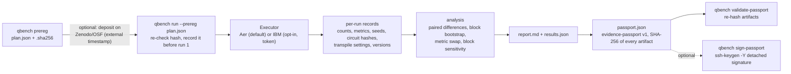

<!-- Copyright (C) 2026 Jean-François Brisson / Spark AI NLP. SPDX-License-Identifier: AGPL-3.0-only -->
# qbench: a preregistered evidence layer for small quantum-circuit benchmarks (concept, unreleased)

> **SIMULATOR ONLY. Concept code, not released.** `qbench` is classical software. It runs small textbook circuits on
> local Qiskit Aer simulators, noiseless or with a **hand-chosen synthetic noise model**. No quantum hardware has
> been used and the repository holds **no hardware results**. Nothing here is a quantum error correction, threshold,
> quantum-advantage or hardware-performance claim.

Author: Jean-François Brisson ([ORCID 0009-0000-9778-5374](https://orcid.org/0009-0000-9778-5374)), Spark AI NLP,
Fredericton, New Brunswick, Canada.

## Purpose

Benchmark numbers for quantum devices and compilers often come with no fixed analysis plan, no paired comparison
and no record of what exactly ran. `qbench` applies the discipline used in this repository's
[SMAP/MSL evaluation](../README.md) to circuit benchmarks:

1. **Preregister** the plan (circuits, conditions, metrics, blocks, bootstrap settings, decision rule) and hash it
   *before* any circuit runs.
2. **Run** every instance under every condition with shared seeds, so differences are paired.
3. **Compare** conditions with a block bootstrap, then report how sensitive the verdict is to the metric and to the
   block definition.
4. **Package** the outputs in an [evidence passport](https://github.com/sparkainlp-x/evidence-passport) that lists
   the SHA-256 of every artifact.

It is meant to **complement** open, vendor-neutral benchmark efforts such as
[Metriq](https://github.com/unitaryfoundation/metriq-gym) (Unitary Foundation) and the
[QED-C application-oriented benchmarks](https://github.com/SRI-International/QC-App-Oriented-Benchmarks). Those
projects own the benchmark definitions and the cross-vendor data. `qbench` only shows how a preregistered paired
analysis and a passport could sit on top of them.

## Workflow



## Plan → run → passport

```bash
python -m pip install ".[quantum]"                        # qiskit + qiskit-aer; the core stays NumPy-only
oes-resilience qbench prereg --out my_plan.json           # plan + my_plan.json.sha256, BEFORE any run
# deposit my_plan.json on Zenodo or OSF here if you need an independent timestamp
oes-resilience qbench run --prereg my_plan.json --out-dir outputs/qbench --verify
oes-resilience qbench validate-passport outputs/qbench/qbench_passport.json
```

* **Plan** (`oes-resilience/qbench-plan/1`). Families `ghz`, `bv` (Bernstein-Vazirani with a seeded hidden string)
  and `qft` (seeded phase encoding followed by an explicit inverse QFT), widths, seed batches, conditions, noise
  models, comparisons, metrics, block schemes, bootstrap settings and a written decision rule. `qbench prereg`
  refuses to overwrite an existing plan. `qbench run --expect-plan-sha256 <hex>` refuses a plan with any other hash.
* **Default conditions.** `ideal` (noiseless), `noisy_o1` and `noisy_o3` (synthetic noise, transpiled at
  optimization level 1 or 3). All conditions target one hypothetical device (basis `rz, sx, x, cx`, linear
  coupling). The noise model is depolarizing p1 = 0.001 after `sx`/`x`, p2 = 0.01 after `cx`, plus a symmetric
  readout flip of 0.02. It is calibrated to no device.
* **Run.** For each instance, `seed_transpiler` and `seed_simulator` come from the plan seed through
  `numpy.random.SeedSequence` and are reused in every condition (common random numbers). Each record stores the
  backend name, software versions, seeds, shots, the SHA-256 of the logical and transpiled circuits (OpenQASM 2),
  the transpile settings, circuit statistics (depth, CX and two-qubit gate counts), counts, the exact ideal
  distribution and three metrics. Wall-clock times go only in `<prefix>_runs.jsonl` and
  `<prefix>_run_metadata.json`, so `<prefix>_results.json` is deterministic and `--verify` compares its hash
  across two complete runs (exit code 4 if they differ).
* **Passport.** `<prefix>_passport.json` follows the evidence-passport run-manifest v1 schema
  (`evidence_class: synthetic`, `result_label: synthetic_example`). It lists the plan copy, results, run records, run
  metadata, report and (hardware only) calibration snapshots, each with its SHA-256.

Outputs: `<prefix>_plan.json`, `_results.json`, `_runs.jsonl`, `_run_metadata.json`, `_report.md`,
`_calibration.json` (hardware runs only) and `_passport.json`.

## Statistical method

**Metrics.** For counts normalised to an empirical distribution *p* and the exact ideal distribution *q*:
Hellinger fidelity *F* = (Σ √(pᵢ qᵢ))², total variation distance TVD = ½ Σ |pᵢ − qᵢ| (lower is better) and
success probability = the mass of *p* on the support of *q*. When the ideal output is a single bitstring (BV, QFT)
the three metrics carry the same information (*F* = *p*, TVD = 1 − *p*). Only GHZ separates them, so in the default
plan a disagreement between metrics is unlikely by construction.

**Paired differences.** For each preregistered comparison (a, b) and metric, every instance gives one difference,
oriented so that a positive value favours b (the sign is flipped for TVD).

**Block bootstrap.** Instances are grouped into blocks. The default primary scheme is *family × seed batch*, which
gives 12 blocks in the default plan. Whole blocks are resampled with replacement (2000 resamples, seeded from the
plan) and the 95% percentile interval of the pooled mean is reported. The verdict follows the interval: b better if
it lies above 0, a better if it lies below 0, otherwise "no significant difference". Fewer than 5 blocks is flagged
as unreliable.

**Robustness checks** (reported, never used to pick a winner):

* *metric swap*: does the verdict change between Hellinger fidelity, TVD and success probability?
* *block-scheme sensitivity*: the same comparison with family-only and batch-only blocks.

### Sample result and block-choice sensitivity (simulator only)

Sample run of the committed plan [`examples/qbench_plan.json`](../examples/qbench_plan.json) (SHA-256
`e0b5bffa…2656c07`, committed before the run). Qiskit 2.5.2, Qiskit Aer 0.17.2, seed 20261007, 108 runs × 2000
shots. Full report: [`examples/qbench_sample/qbench_report.md`](../examples/qbench_sample/qbench_report.md).
**These are Qiskit Aer simulations under a synthetic noise model, not hardware measurements.**

| condition | mean Hellinger fidelity |
|---|---|
| `ideal` | 1.0000 |
| `noisy_o1` | 0.8480 |
| `noisy_o3` | 0.8667 |

Primary comparison `noisy_o3` vs `noisy_o1`, Hellinger fidelity, mean paired difference +0.0187:

| blocks | n blocks | 95% interval | verdict |
|---|---|---|---|
| family × batch (preregistered primary) | 12 | [+0.0053, +0.0324] | `noisy_o3` better |
| family only | 3 (flagged) | [+0.0000, +0.0538] | no significant difference |
| batch only | 4 (flagged) | [+0.0183, +0.0191] | `noisy_o3` better |

The verdict **depends on how instances are blocked**, and the report shows this rather than hiding it:

* Almost the whole effect comes from `qft` (+0.0538). `bv` contributes +0.0022 and `ghz` exactly 0. In this
  sample, optimization level 3 cuts the mean transpiled CX count for `qft` from 29.7 to 18.8. For `bv` it goes
  from 4.2 to 3.8, and for `ghz` it stays at 3.0.
* With family-only blocks there are just three very different blocks, and the interval reaches 0.
* Batch-only blocks each pool all three families. Their means are therefore nearly equal, and the interval is
  implausibly narrow because it ignores the between-family heterogeneity.
* The preregistered family × batch scheme lies between the two. The honest summary: on this synthetic device,
  optimization level 3 helps QFT-style circuits and barely matters for the others. The result does not support a
  general claim.

No metric flip occurs; as explained above, that is expected for this plan.

## Optional: hardware adapter and calibration snapshots

`qbench_ibm.py` (extra `ibm`, `qiskit-ibm-runtime`) is **off by default**. It is used only if
`OES_QBENCH_IBM_TOKEN` is set **and** the plan has a condition with `"target": "ibm"` and a `"backend"`. Otherwise
`qbench run` exits with code 2 before any backend is created. The token is read from the environment and never
written anywhere. For each hardware run, `calibration_snapshot()` records what the backend reports at run time:
per-qubit T1, T2 and frequency, per-instruction error and duration for each qubit tuple, and the properties
timestamp when the backend exposes one. Snapshots are stored once per distinct calibration in
`<prefix>_calibration.json`, referenced from each record by `calibration_sha256`, and listed in the passport.

**Status:** this path is tested only against Qiskit's `GenericBackendV2` and mock objects (job submission is
mocked). It has never run on a QPU. Hardware runs are snapshots of a drifting device, so a single run says little
about the device in general.

## Optional: detached signatures

Hashes show only that files are byte-for-byte identical to the recorded digests. They do not show who made them.
For that, a passport can be signed with an SSH key (OpenSSH 8.1+, no extra Python dependency):

```bash
oes-resilience qbench sign-passport outputs/qbench/qbench_passport.json --key ~/.ssh/id_ed25519
# writes outputs/qbench/qbench_passport.json.sig (namespace "oes-resilience-qbench-passport")

# verifier: allowed_signers maps an identity to a public key, e.g. one taken from https://github.com/<user>.keys
echo "author@example.org ssh-ed25519 AAAA..." > allowed_signers
oes-resilience qbench verify-signature outputs/qbench/qbench_passport.json \
    --allowed-signers allowed_signers --identity author@example.org
```

The passport embeds the SHA-256 of every artifact, so a valid signature on the passport also covers the artifacts.
Run `qbench validate-passport` as well to check that they still match. **A valid signature proves only that the
holder of that private key signed these bytes.** It does not prove when, that the run happened as described, or
that the method or measurements are valid. For keyless signing with a public transparency log, Sigstore
(`cosign sign-blob --bundle passport.sigstore.json qbench_passport.json`) is an alternative. That alternative is
documented here but not wrapped or tested by this repository.

## Submitting to Metriq

`qbench` output is **not** in Metriq format, and there is no automatic export. To contribute results to
[Metriq](https://metriq.info), use Unitary Foundation's [metriq-gym](https://github.com/unitaryfoundation/metriq-gym)
(Apache-2.0), which owns the benchmark definitions:

```bash
pip install metriq-gym
mgym job dispatch <benchmark-config>.json -p local -d aer_simulator   # or a real provider/device you have access to
mgym job poll latest                                                  # retrieve the results
mgym job upload                                                       # opens a pull request with the results on GitHub
```

See the metriq-gym [CLI reference](https://unitaryfoundation.github.io/metriq-gym/cli/overview/) for provider
credentials and suites (`mgym suite dispatch/poll/upload`). A reasonable combination: preregister the comparison
with `qbench prereg`, run the official metriq-gym benchmark, and keep the `qbench` passport next to the submission
as the record of what was planned and run. Mark simulator results as simulator results.

## Limitations

* **Simulator only.** The noise model is synthetic and hand-chosen. It is not calibrated to, and says nothing
  about, any real device.
* **Small, local circuits.** GHZ, BV and QFT-style circuits are implemented in `qbench_sim.py`. They are not imported
  from MQT Bench, QED-C or Metriq, and they are not a recognised suite. MQT Bench was not used because it needs
  Python ≥ 3.11 plus scikit-learn and networkx.
* **Block dependence.** The interval and even the verdict depend on the block definition; see the sensitivity table
  above. With a few heterogeneous families, results are dominated by the family mix chosen in the plan.
* **Version dependence.** Simulator counts depend on the Qiskit and Qiskit Aer versions. Byte-identical reruns are
  expected only with the same versions.
* **Self-attested lock.** `qbench run` records the plan hash before the first run, but that is not an independent
  timestamp. An external deposit (Zenodo, OSF), or at least a public git commit as for the sample plan, is needed
  for a credible lock.
* **Hashes and signatures are not provenance.** See above.
* **The hardware adapter is untested on hardware.**
* **No claim** of QEC, threshold, quantum advantage or hardware performance is made or supported.
